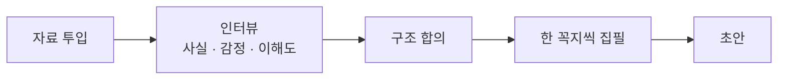
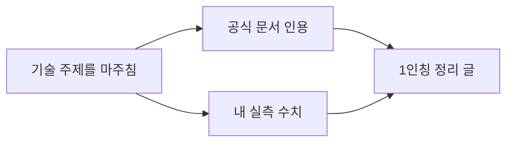
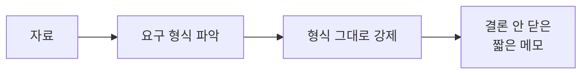
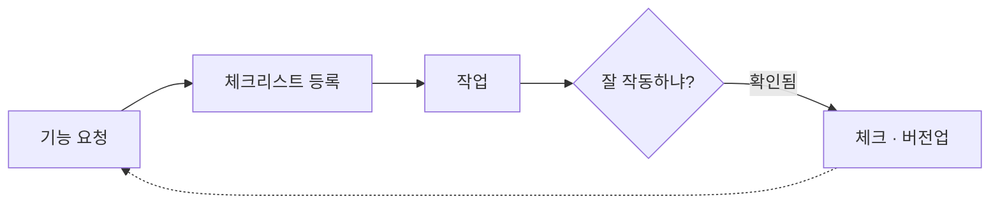
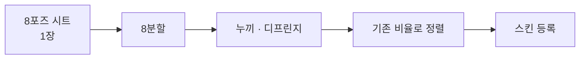
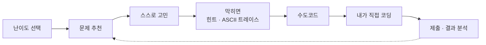

# skills

> Claude Code가 특정 작업에서 자동으로 발동하는, 내가 만든 커스텀 스킬 모음입니다.
> 반복하는 글쓰기 · 학습 · 제작 과정을 규칙으로 굳혀 둔 것들입니다.

각 폴더의 `SKILL.md`가 스킬 본문입니다. 위쪽 frontmatter의 `description`이 발동 조건이고, 본문이 그때 Claude가 따르는 절차입니다.

각 스킬마다 **하는 일**(무엇을 대신 해 주는지)과 **핵심 흐름**(그때 밟는 절차)을 함께 적어 뒀습니다.

 

## 글을 대신 쓴다

### 회고 글을 쓴다 · [`mission-retrospective`](mission-retrospective/SKILL.md)

**하는 일** — 자료만 던진다고 바로 초안을 쓰지 않는다. 먼저 인터뷰로 무엇을 했고 무엇이 어려웠는지, 뭘 이해했고 뭘 몰랐는지부터 확인한다. 그다음 글 구조를 같이 합의하고 한 꼭지씩 순서대로 쓴다. 우테코 미션처럼 리뷰와 수정이 반복되는 학습 회고에 특히 맞춰져 있다. 결론만 압축해서 던지지 않고, 처음 읽는 사람도 내 고민과 바뀐 지점을 따라올 수 있게 쓰는 게 목적이다.

**핵심 흐름**

### 기술 노트를 쓴다 · [`tech-learning-note`](tech-learning-note/SKILL.md)

**하는 일** — 어떤 기술 주제를 마주친 뒤 그걸 정리해서 공유하는 글을 쓴다. API 동작 방식이나 도구 내부 같은 것들이다. 회고와 달리 인터뷰나 감정을 확인하는 단계가 없다. 공식 문서 인용과 내가 직접 잰 수치를 양 축으로 잡고, 담담한 1인칭 정리 톤으로 쓴다.

**핵심 흐름**

### 우테코 사전학습 답을 쓴다 · [`mission-pre-study`](mission-pre-study/SKILL.md)

**하는 일** — 우테코 미션의 사전학습 · 토론 활동 산출물을 쓴다. 자료가 요구한 형식을 가장 먼저 지킨다. "사실 1개 + 문제 1개" 같은 형식이 있으면 그대로 맞추고, 결론을 닫지 않은 짧은 메모로 남긴다. 회고나 블로그 톤은 쓰지 않는다.

**핵심 흐름**

 

## 만드는 과정을 돕는다

### 기능 개발을 버전으로 관리한다 · [`panda`](panda/SKILL.md)

**하는 일** — 진행 중인 프로젝트에 새 기능 요청이 들어오면 체크리스트에 등록한다. 작업을 마치면 "잘 작동하냐"고 검증 질문을 던지고, 내가 확인해주면 체크하고 버전을 올린다. 한 번에 몰아서 하지 않고 요청 → 작업 → 검증 → 버전업을 한 단위씩 밟는다.

**핵심 흐름**

### 캐릭터 포즈 시트를 스킨으로 자른다 · [`skin-sheet-split`](skin-sheet-split/SKILL.md)

**하는 일** — 캐릭터 8포즈가 담긴 시트 한 장을 token-panda 스킨 규격에 맞춰 8장으로 잘라 정렬하고 등록한다. 흰 배경과 투명 배경을 둘 다 처리하고, 누끼 흰 테두리를 정리한 뒤 기존 캐릭터와 같은 비율로 위치를 맞춘다. 분할을 실제로 수행하는 `split_sheet.py`가 함께 들어 있다.

**핵심 흐름**

 

## 스스로 배우게 한다

### 백준 문제를 답 없이 푼다 · [`algo-study`](algo-study/SKILL.md)

**하는 일** — 답을 바로 주지 않는다. 난이도를 고르고 문제를 추천한 다음, 내가 먼저 고민하게 둔다. 막히면 알고리즘의 정체와 필요성만 조금씩 열어주고, ASCII로 동작을 그려 보인다. 수도코드까지 소크라테스식 문답으로 끌고 간 뒤, 코드는 내가 직접 쓴다. 진도는 파일로 남겨 다음에 멈춘 자리부터 이어간다.

**핵심 흐름**

